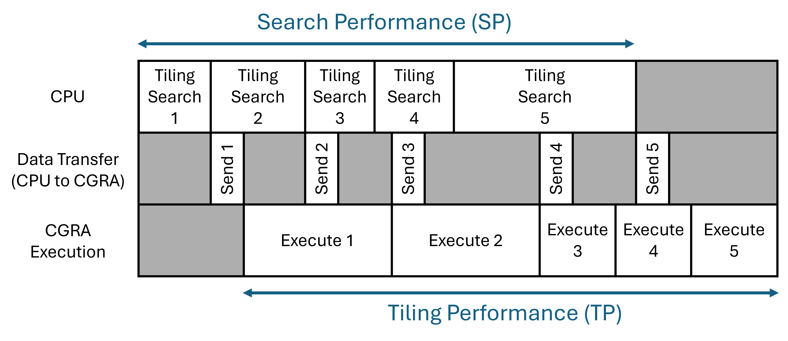
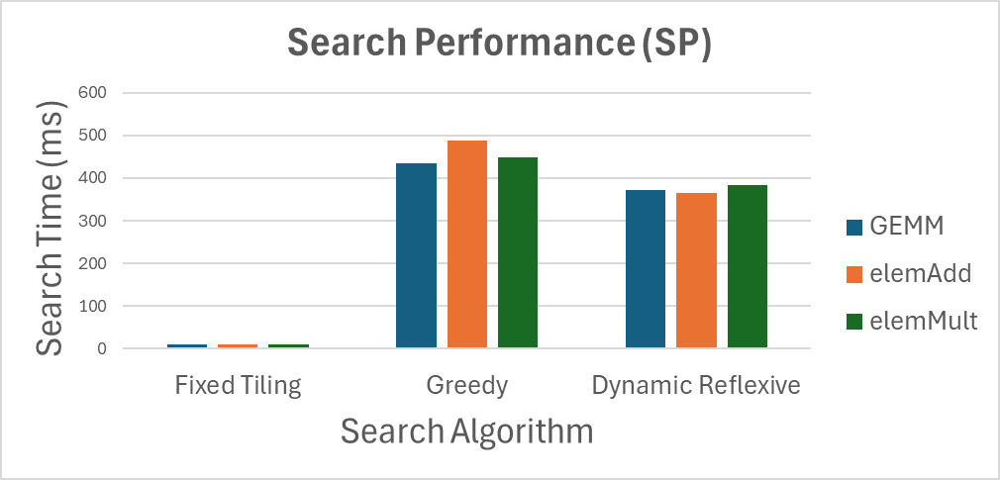
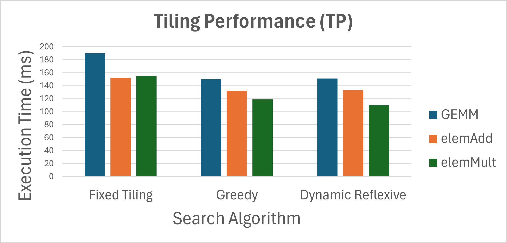
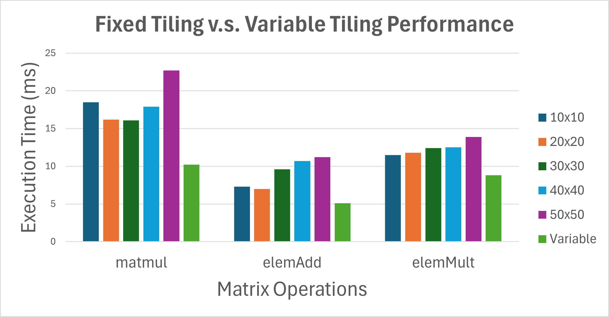
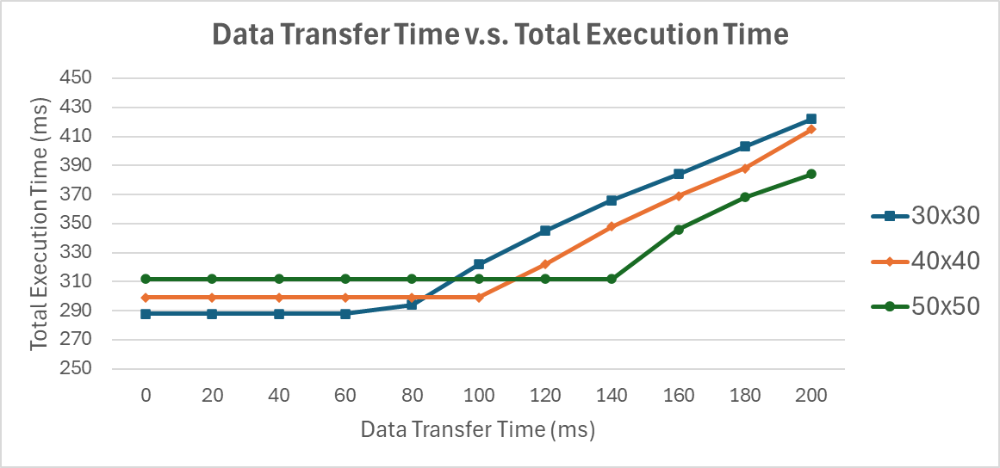

# tiler-swift
CS348K Term Project for Efficient Sparse Tensor Tiling on CGRA

## Team Members
* [Po-Han Chen (pohan@stanford.edu)](mailto:pohan@stanford.edu)
* [Bo Wun Cheng (bwcheng@stanford.edu)](mailto:bwcheng@stanford.edu)

## Summary
We are going to implement an efficient tiling software to speed up sparse tensor operations on coarse-grained reconfigurable arrays (CGRAs) [1]. We will show the run time comparison between different sparse tiling strategies. This software will contain a tile size searching algorithm and an application performance model. They  work as a feedback loop to determine the best tiling size to execute on CGRAs. By the end of this project, we hope to actually deploy this software into our CGRA chip and measure its performance. 

## Inputs and Outputs
We want the software to analyze the sparsity in the given matrices and report the best tiling parameters of the given operation under given hardware conditions.
* Inputs
    * Matrices
        * For simplicity, we only consider 2D matrices for this project. It should be extended to N-D tensor for generality
    * Target matrix operation
        * GEMM, element-wise addition/multiplication, reduction...
    * Hardware constraints
        * memory tile capacity, CPU/CGRA clock speed, data transfer speed...
* Outputs:
    * a sequence of tiling parameters for the matrices
        * This will be the inputs to another tool that converts the matrices into sparse fibertree format [2] to execute on the CGRA.

## Task List
### Basics
* Randomlly generate matrices with different sizes and sparsities.
* Finalize the format for a configuration text file that contains the target operation and hardware constriants.
* Implement basic software structure to read in the matrices and contraints, the write out the entire matrix without any tiling.
* Repeat last step, but this time with fixed tiling.
* feed the fixed tiling results to the downstream tool and make sure it can operate.
### Advanced
* Implement different tile size searching algorithms (for example, the dynamic reflexive tiling [3]). Starting from the easiest.
* Implement the performance model for different operations under given hardware constraints. Use this information as a guide for the searching algorithm.
* Record the performance of the search space.
### Good to have
* Try to improve the software performance for fast searching.
* Consider the data transfer time as overhead, weight it into the performance model.

## Performance Definition
The goal of this project is to do performant tiling. In terms of performance, we consider it from the following two perspectives:
* **Search performance (SP)**
    * How fast can the tool generate the tiling parameters?
* **Tiling performance (TP)**
    * How quickly can the computation be executed given the tiling parameters?

With this in mind, we add the following two assumptions:

**Assumption-1:** The data transfer time is small enough such that it won't be the bottleneck of the overall system. However, if there is enough time, we should also consider the case that the tranfer time is significant and think about the corresponding solutions.

**Assumption-2:** There is unlimited storage on the CPU side to store the tiling results, such that there is no gap between each tiling search.

Under these two assumptions, the overall performance is determined by SP and TP.

## Expected Deliverables
At the end of the project, we want to show how different tiling parameters/algorithms/models affect the performance. In our system, we have the following knobs that can affect the performance metrics:
* Size of the input matrix
* Sparsity of input matrix
* Tile size (fixed tile size or variable tile size)
* Search algorithm
* Performance model
* Matrix operation

Specifically, we want to show the following figures (numbers are fake):

### Search Algorithm (or Runtime Model) Performance

These bar charts show the performance of using different searching algorithm, the same charts can also be used to show how different *runtime model* performs.

### Fixed Tiling v.s. Variable Tiling

This bar chart shows the performance comparison between fixed-size tiling versus variable-size tiling. We expect to see better performance in variable-size tiling because it can adapt to local statistical distribution

### Data Transfer Time Bottleneck

When the data transfer time is big enough, the total runtime should started to be bottlenecked by it. We expect the knee point is proportional to how big the tile size is. Hence, the solution is that the software will tend to choose bigger tile size when it sees the data transfer time is big, such that the overall runtime can be optimized.

## Risks
**[Place Holder]** *Please document the biggest risks in the project. Often there are points or blockers such as, if I can't get this code to compile/run, then I can't do the work. Or, until I am successfully training this DNN and have reasonable trained model, I can't do aynthing else. I want you to think through the risks on your project, and consider how to eliminate/derisk these aspects of the project with as little work as possible.*

## Help
**[Place Holder]** *What advice would like from Kayvon and Arden? Are there papers you need references to? Do you need a machine or computing resources to succeed?*

## References
[1] K. Koul, et. al, "AHA: An Agile Approach to the Design of Coarse-Grained Reconfigurable Accelerators and Compilers," in ACM Transactions on Embedded Computing Systems (TECS), April 2022 (https://dl.acm.org/doi/full/10.1145/3534933)

[2] O. Hsu, et. al, "The Sparse Abstract Machine," in International Conference on Architectural Support for Programming Languages and Operating Systems (ASPLOS), March 2023 (https://dl.acm.org/doi/10.1145/3582016.3582051)

[3] T. O. Odemuyiwa, et. at, "Accelerating Sparse Data Orchestration via Dynamic Reflexive Tiling," in International Conference on Architectural Support for Programming Languages and Operating Systems (ASPLOS), March 2023 (https://dl.acm.org/doi/10.1145/3582016.3582064)