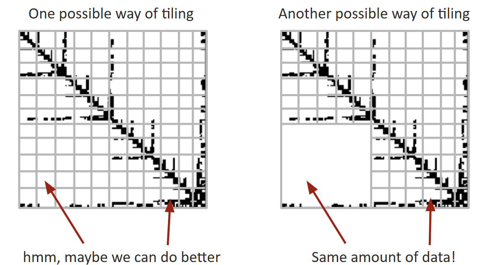
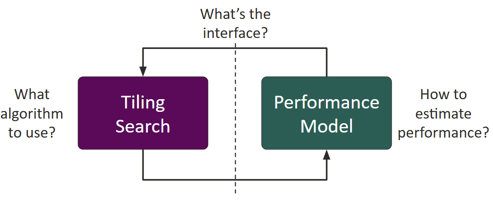

# Tiler-Swift

Tiler-Swift is an efficient tiling software to speed up sparse tensor operations on coarse-grained reconfigurable arrays (CGRAs) [1]. We will show the run time comparison between different sparse tiling strategies. This software will contain a tile size searching algorithm and an application performance model. They work as a feedback loop to determine the best tiling size to execute on CGRAs.

# Background and Setup

Specialized hardware has limited memory, so input data, often in the form of tensors, must be split into smaller segments called tiles. Usually, these tiles are of equal size to fit into memory efficiently. However, this method doesn't work well with sparse data, where some tiles have many zeros and others have many non-zero values. After compressing sparse data, tiles of the same initial size may end up with different storage sizes. To better use the hardware memory, we can use larger tiles that cover more of the input tensor, reducing the number of tiles needed.

To make Tiler-Swift work, it looks at three things. First, it checks how many zeros are in the input data. Second, it figures out what's being done to the data, so it can predict how much space it will need in the ouptut. Lastly, it needs to know about the computer's memory limits. These three things help Tiler-Swift decide how to split up the data into tiles. The result is a tiled picture based on these factors.

The tool has two main parts: the tiler and a performance model. They work together in a loop to find the best tiling that fits the given limits. The challenge is to work out how the tiling search algorithm operates, how the model predicts performance, and how they exchange information with each other.

# Approach

<!--

(approx 1-2 pages max)

Please describe your approach.  Please be brief (about a page or so max), but your description should be sufficiently detailed to provide the course staff a basic understanding of your approach. It might be very useful to include a figure here illustrating components of the system and/or their mapping to parallel hardware/or a DNN architecture.

* If your project involved optimizing code. Please describe the process of how you iterated toward a solution (what measurements did you make) What did you try that did not work? How to parts of the problem map to cores, threads, or vector lanes?

* If your project involved optimizing a DNN architecture, you could describe the architecture here, and be sure to provide intuition about how your model architecture choices were motivated by your goals.

* __If your project involved started with an existing piece of code or DNN model, please clearly describe what you started with here, so it's clear what work you actually did in your project. e.g., "We started with this codebase and made these changes..."__
-->

# Evaluation and Results

<!--

    Additional questions that Kayvon & TAs want us to address

    * do more complex perf model, does that help with tiling results? how does it scale
    * does complex searching algorithm actually give you better results? can I just run brute force overnight, and it gives you best results?
-->

<!--

(as many pages as needed to make the points you want to make)

To the staff, this is the most important part of the writeup. Begin by providing your own definition of success (this should be in terms of your goals). In other words, re-iterate the question you were trying to answer, or the performance boost you were hoping to obtain. Then describe what data/experiment needs to be run to provide evidence that the goals were either met or not met.

Now describe the relevant parts of your experimental setup. What were the baseline algorithms? What machine was a performance test run on? What did you measure? What was the dataset used?  If you have a programming abstraction project, the experimental setup might include a description of the programs you implemented expressed using the API.

Finally, I want to see the results of an experiment that demonstrate success (or failure) to meet goals. Sometimes great projects fail to meet their goals, or falsify a hypothesis, but they still do a great job in the scientific process of verifying this.

This might include:

* Provide graphs of speedup or execution time?
* Compare total flops or model size
* Compare precision and recall of a model.
* Demonstrate that a 3D NeRF model was obtained, show output images of sufficient quality, etc.

IMPORTANT: In this writeup, I want you to interpret your graphs and numbers for me. What this means will be project dependent, but I want you to consider questions such as: Why does the graph look like it does? Does it make sense to you? What limited your speedup? Is it a lack of parallelism? (dependencies) Communication or synchronization overhead? Data transfer (memory-bound or bus transfer bound)? If a model is performing well, what are it's failure cases? When does it fail to generalize.

As you answer these questions, provide data and measurements to support your conclusions. If you are merely speculating, please state this explicitly. Performing a solid analysis of your implementation is a good way to pick up credit even if your optimization efforts did not yield the performance you were hoping for.
-->

# Team Responsibilities

<!--
Please provide a [very short] breakdown of which parts of the project were performed by each team member. In general we hope to (and intend to) give all team members the same grade, but we still want to know what everyone worked on and what their role was.   
-->

Both team members equally contributed to this project.
* Po-Han Chen (50%)
    * Software framework
    * Baseline searching algorithms and performance models
    * Result visualization
* Bo Wun Cheng (50%)
    * Integration with cycle accurate simulator [3]
    * Optimizating searching algorithms
    * Result collection and evaluation

# References
[1] K. Koul, et. al, "AHA: An Agile Approach to the Design of Coarse-Grained Reconfigurable Accelerators and Compilers," in ACM Transactions on Embedded Computing Systems (TECS), April 2022 (https://dl.acm.org/doi/full/10.1145/3534933)

[2] O. Hsu, et. al, "The Sparse Abstract Machine," in International Conference on Architectural Support for Programming Languages and Operating Systems (ASPLOS), March 2023 (https://dl.acm.org/doi/10.1145/3582016.3582051)

[3] R. Lacouture, et. al, "comal" (https://github.com/stanford-ppl/comal)

[4] T. O. Odemuyiwa, et. at, "Accelerating Sparse Data Orchestration via Dynamic Reflexive Tiling," in International Conference on Architectural Support for Programming Languages and Operating Systems (ASPLOS), March 2023 (https://dl.acm.org/doi/10.1145/3582016.3582064)
